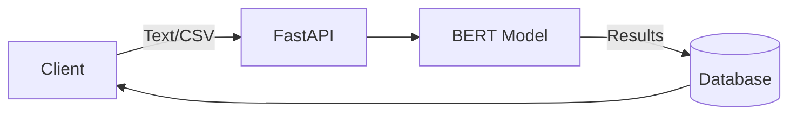

# 🤖 Aspect-Based Sentiment Analysis (ABSA) API

<div align="center">


[](https://www.kaggle.com/mohammed237)

A high-performance REST API for **Aspect-Based Sentiment Analysis** that processes both individual texts and large-scale CSV datasets using fine-tuned BERT models.

[Features](#-features) • [Quick Start](#-quick-start) • [Model Setup](#-model-setup) • [API Docs](#-api-documentation)

</div>

---

## 🚀 Features

- 🧠 **Fine-Tuned BERT** trained on MAMS dataset + SpaCy for aspect extraction
- ⚡ **Fast & Efficient** async processing for both text and CSV files
- 🔐 **JWT Authentication** for secure API access
- 📊 **Unified Session System** handles both text and file uploads
- 📑 **OpenAPI/Swagger UI** with interactive documentation
- ⚡ **Ultra-Fast Performance** with async/await support

---

## 🏗️ Architecture



**Workflow**: Text/CSV requests → instant analysis → results stored in database

---

## 🛠️ Tech Stack

| Layer    | Technology                       |
| -------- | -------------------------------- |
| **API**  | FastAPI + Pydantic               |
| **ML**   | PyTorch + Transformers + SpaCy   |
| **Auth** | JWT (python-jose)                |
| **DB**   | SQLite (dev) / PostgreSQL (prod) |
| **ORM**  | SQLAlchemy                       |

---

## ⚡ Quick Start

### Prerequisites

- Python 3.11+
- Git

### Installation

```bash
# 1. Clone and navigate
git clone https://github.com/yourusername/absa-api.git
cd absa-api

# 2. Setup virtual environment
python -m venv venv
source venv/bin/activate  # On Windows: venv\Scripts\activate

# 3. Install dependencies
pip install -r requirements.txt
python -m spacy download en_core_web_sm

# 4. Setup environment variables
cp .env.example .env
# Edit .env with your configuration

# 5. Setup database
alembic upgrade head
```

### Run the Application

```bash
# Start API Server
uvicorn main:app --reload --host 0.0.0.0 --port 8000
```

**✅ API Ready**: http://127.0.0.1:8000  
**📖 Docs**: http://127.0.0.1:8000/docs  
**📖 ReDoc**: http://127.0.0.1:8000/redoc

---

## 🧠 Model Setup

The fine-tuned BERT model is required for sentiment analysis. Choose one option:

### Option 1: Download From Kaggle (Easiest way)

**[Download Model](https://www.kaggle.com/models/mohammed237/absa-bert-model)**

### Option 2: Train Locally (Recommended for customization)

- [**Download the dataset**](https://www.kaggle.com/datasets/mohammed237/mams-processed-bert)

- Run train Notebook

  ```bash
    jupyter notebook Notebooks/train.ipynb
  ```

- Fine-tune BERT for aspect-based sentiment analysis
- Save the model to `./models/bert_absa/`

### Option 3: Train on Kaggle (For more details and GPU access)

1. Open the Kaggle notebook **[ABSA BERT Training](https://www.kaggle.com/code/mohammed237/absa-train-bert)** and run it
2. Enable GPU accelerator in notebook settings
3. Run all cells to train the model
4. Download the trained model from Kaggle output
5. Place in `./models/bert_absa/` directory

**Model Directory Structure**:

```
models/
└── bert_absa/
    ├── config.json
    ├── pytorch_model.bin
    └── vocab.txt
```

---

## 📖 API Documentation

**Interactive Docs**: http://127.0.0.1:8000/docs  
**ReDoc**: http://127.0.0.1:8000/redoc

### Quick Reference

| Endpoint                        | Method | Description                     | Auth |
| ------------------------------- | ------ | ------------------------------- | ---- |
| `/api/v1/register`              | POST   | Register a new user             | ❌   |
| `/api/v1/login`                 | POST   | Authenticate user and get token | ❌   |
| `/api/v1/analyze/`              | POST   | Analyze text                    | ✅   |
| `/api/v1/upload/`               | POST   | upload csv file                 | ✅   |
| `/api/v1/history/`              | GET    | Get user history                | ✅   |
| `/api/v1/history/{session_id}/` | GET    | Get session details             | ✅   |

### Using the API with Swagger UI

FastAPI comes with built-in interactive API documentation. Simply navigate to:

**Swagger UI**: http://127.0.0.1:8000/docs

#### How to use Swagger UI:

1. **Authentication**:

   - First, register a new user using the `/api/v1/register` endpoint
   - Login using `/api/v1/login` to get your access token
   - Click the **"Authorize"** button (🔒) at the top right
   - Enter your token in the format: `Bearer YOUR_TOKEN`
   - Click "Authorize" and then "Close"

2. **Text Analysis**:

   - Navigate to the `/api/v1/analyze/` POST endpoint
   - Click "Try it out"
   - Enter your text in the request body:
     ```json
     {
       "text": "The food was excellent but the service was slow."
     }
     ```
   - Click "Execute" to see results

3. **CSV Upload**:

   - Navigate to the `/api/v1/upload/` POST endpoint
   - Click "Try it out"
   - Click "Choose File" and select your CSV file
   - Click "Execute" to upload and process

4. **View History**:
   - Use `/api/v1/history/` to see all your analysis sessions
   - Use `/api/v1/history/{session_id}/` to get detailed results for a specific session

All responses, request schemas, and status codes are documented interactively in Swagger UI!

---

## 📁 Project Structure

```
absa-api/
├── app/
│   ├── api/
│   │   └── v1/
│   │       ├── __init__.py
│   │       └── deps.py          # API dependencies
│   ├── core/
│   │   ├── __init__.py
│   │   ├── config.py            # Configuration settings
│   │   └── security.py          # JWT & password hashing
│   ├── db/
│   │   ├── __init__.py
│   │   ├── base.py              # Database base class
│   │   ├── crud_user.py         # User CRUD operations
│   │   └── session.py           # Database session
│   ├── models/
│   │   ├── __init__.py
│   │   ├── analysis.py          # Analysis model
│   │   ├── session.py           # Session model
│   │   └── user.py              # User model
│   ├── schemas/
│   │   ├── __init__.py
│   │   ├── analysis.py          # Analysis schemas
│   │   ├── session.py           # Session schemas
│   │   └── user.py              # User schemas
│   ├── services/
│   │   ├── __init__.py
│   │   └── ai_model.py          # BERT model & inference
│   └── __init__.py
├── model/
│   └── bert_absa/               # Fine-tuned BERT model
│       ├── config.json
│       ├── pytorch_model.bin
│       └── vocab.txt
├── main.py                      # FastAPI application entry
├── requirements.txt             # Python dependencies
└── README.md                    # This file
```
