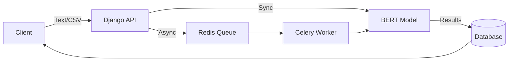

# 🤖 Aspect-Based Sentiment Analysis (ABSA) API

<div align="center">


[](https://www.kaggle.com/mohammed237)

A high-performance REST API for **Aspect-Based Sentiment Analysis** that processes both individual texts and large-scale CSV datasets using fine-tuned BERT models.

[Features](#-features) • [Quick Start](#-quick-start) • [Model Setup](#-model-setup) • [API Docs](#-api-documentation)

</div>

---

## 🚀 Features

- 🧠 **Fine-Tuned BERT** trained on MAMS dataset + SpaCy for aspect extraction
- ⚡ **Async Processing** with Celery workers for bulk CSV analysis
- 🔐 **JWT Authentication** for secure API access
- 📊 **Unified Session System** handles both sync text and async file uploads
- 📑 **Swagger UI** for interactive API testing

---

## 🏗️ Architecture



**Workflow**: Text requests → instant analysis | CSV uploads → background processing with progress tracking

---

## 🛠️ Tech Stack

| Layer     | Technology                       |
| --------- | -------------------------------- |
| **API**   | Django REST Framework            |
| **Queue** | Celery + Redis                   |
| **ML**    | PyTorch + Transformers + SpaCy   |
| **Auth**  | JWT (simplejwt)                  |
| **DB**    | SQLite (dev) / PostgreSQL (prod) |

---

## ⚡ Quick Start

### Prerequisites

- Python 3.11+
- Redis 7.x+
- Git

### Installation

```bash
# 1. Clone and navigate
git clone https://github.com/yourusername/absa-api.git
cd absa-api

# 2. Setup virtual environment
python -m venv venv
source venv/bin/activate  # On Windows: venv\Scripts\activate

# 3. Install dependencies
pip install -r requirements.txt
python -m spacy download en_core_web_sm

# 4. Setup database
python manage.py migrate
python manage.py createsuperuser

# 5. Start Redis (in separate terminal)
redis-server
```

### Run the Application

Open **3 terminals**:

```bash
# Terminal 1 - API Server
python manage.py runserver

# Terminal 2 - Celery Worker
## Windows
celery -A ABSAapi worker --pool=solo -l info
## Mac/Linux
celery -A ABSAapi worker -l info

# Terminal 3 - Celery Beat (optional)
celery -A ABSAapi beat -l info
```

**✅ API Ready**: http://127.0.0.1:8000/api  
**📖 Docs**: http://127.0.0.1:8000/api/docs/

---

## 🧠 Model Setup

The fine-tuned BERT model is required for sentiment analysis. Choose one option:

### Option 1: Download From Kaggle (Easiest way)

**[Download Model](https://www.kaggle.com/models/mohammed237/absa-bert-model)**

### Option 2: Train Locally (Recommended for customization)

- [**Download the dataset**](https://www.kaggle.com/datasets/mohammed237/mams-processed-bert)

- Run train Notebook

  ```bash
    jupyter notebook Notebooks/train.ipynb
  ```

- Fine-tune BERT for aspect-based sentiment analysis
- Save the model to `./models/bert_absa/`

### Option 3: Train on Kaggle (For more details and GPU access)

1. Open the Kaggle notebook **[ABSA BERT Training](https://www.kaggle.com/code/mohammed237/absa-train-bert)** and run it
2. Enable GPU accelerator in notebook settings
3. Run all cells to train the model
4. Download the trained model from Kaggle output
5. Place in `./models/bert_absa/` directory

**Model Directory Structure**:

```
models/
└── bert_absa/
    ├── config.json
    ├── pytorch_model.bin
    └── vocab.txt
```

---

## 📖 API Documentation

**Interactive Docs**: http://127.0.0.1:8000/api/docs/

### Quick Reference

| Endpoint              | Method | Description                          | Auth |
| --------------------- | ------ | ------------------------------------ | ---- |
| `/api/register`       | POST   | Register a new user                  | ❌   |
| `/api/login/`         | POST   | Get JWT Bearer Token (for code/apps) | ❌   |
| `/api-auth/login/`    | GET    | Browser Login (Standard HTML Page)   | ❌   |
| `/api/sessions/`      | POST   | Analyze text/CSV                     | ✅   |
| `/api/sessions/`      | GET    | List sessions                        | ✅   |
| `/api/sessions/{id}/` | GET    | Get results                          | ✅   |
| `/api/sessions/{id}/` | GET    | Get results                          | ✅   |

---

<div align="center">

**⭐ Star this repo if you find it useful!**


</div>
